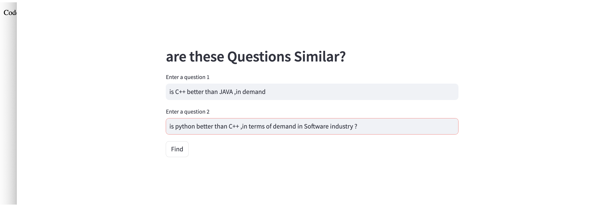

# DejaVU-Questions ☯️

## Introduction 👋
This project aims to provide a user-friendly interface for comparing the semantic similarity between two questions.
The application utilizes a machine learning model trained on questions data to predict whether the provided questions are duplicates or not. 

## How It Works ⚙️
1. Access the Web Application: The application is hosted on Heroku, and you can access it through your web browser. 💻

2. Input Questions: Enter two questions you want to compare in the provided text fields. 💬

3. Get Predictions: Click the "Find" button, and the machine learning model will predict whether the questions are duplicates or not❓

4. View Results: The application will display the prediction result, indicating whether the questions are semantically similar or not. 👀

## Machine Learning Model 🤖
The machine learning model used in this project is based on the RandomForest classifier, an ensemble learning algorithm. The model is trained on a dataset of question pairs with labeled duplicates. To improve its accuracy, exploratory data analysis and feature engineering techniques have been employed to introduce informative features. 📊

